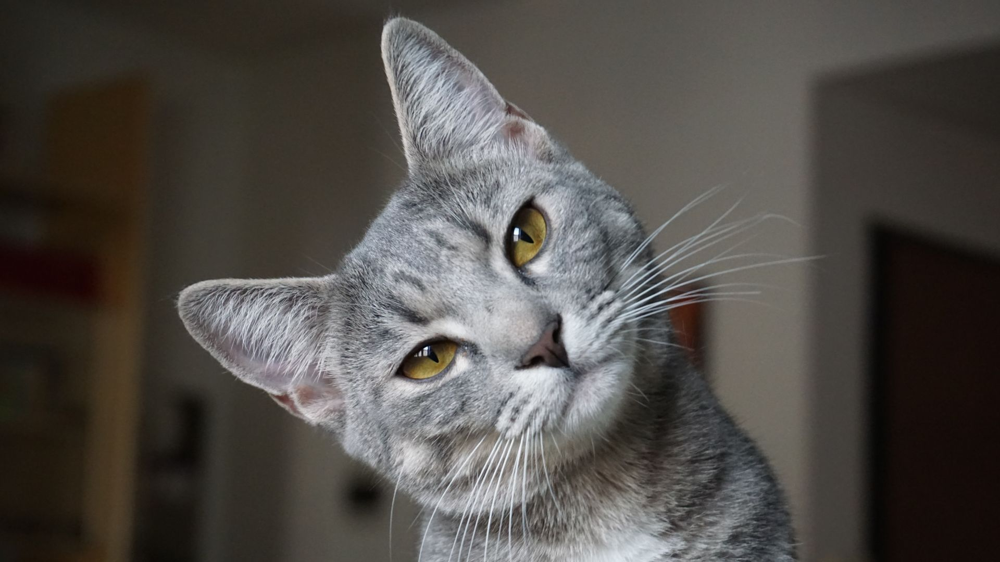
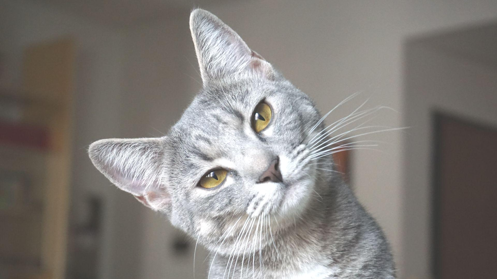
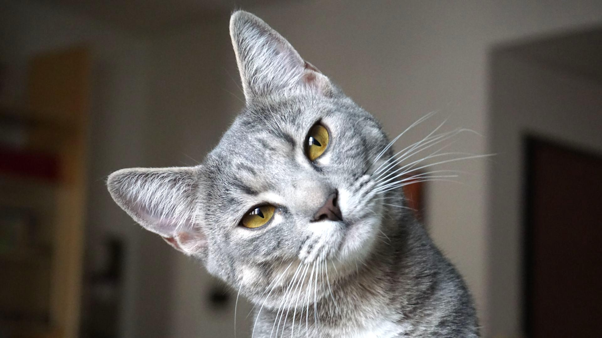
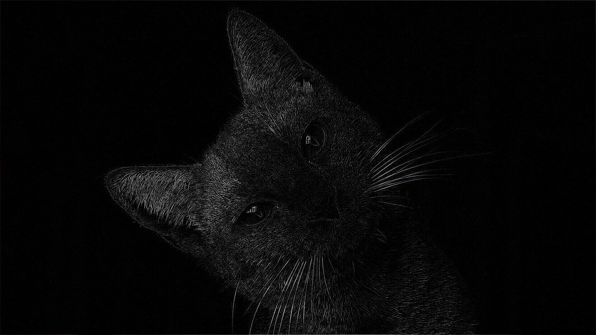
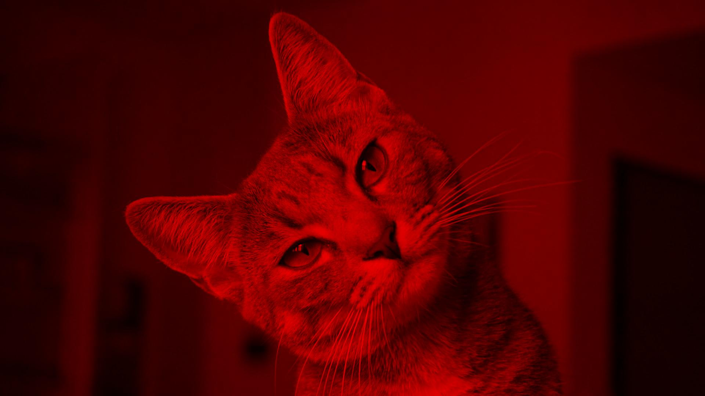
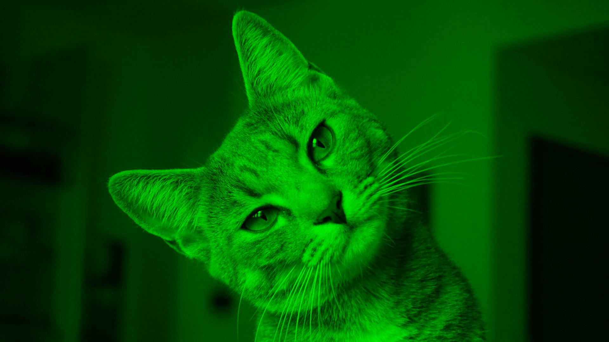
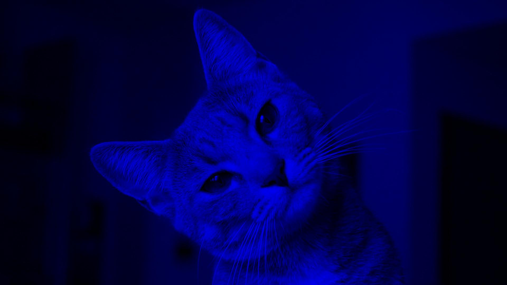
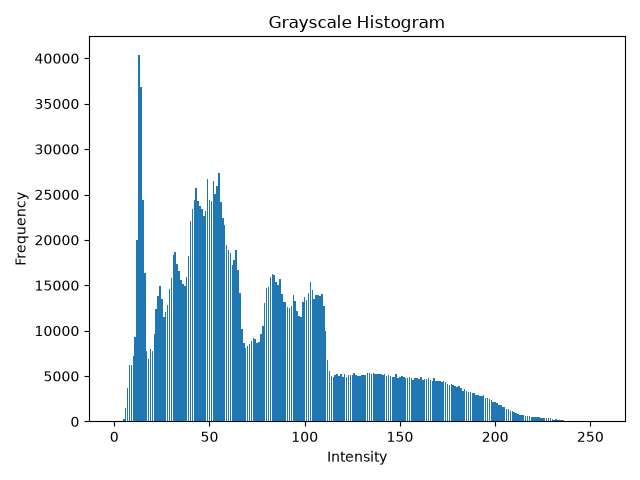
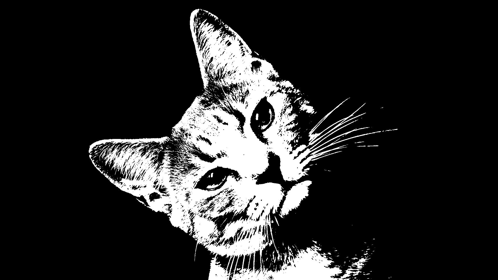

# NumPy Image Toolkit
A beginner-friendly image processing toolkit built with Python, NumPy, Pillow and Matplotlib. It demonstrates fundamental image processing techniques using modular and clean code.

This project performs basic image processing operations such as grayscale conversion, brightness adjustment, contrast enhancement, filtering, histogram generation and binary thresholding.

## Features
- Image Information
- Grayscale Conversion
- Brightness Adjustment
- Darkness Adjustment
- Image Inversion
- Contrast Enhancement
- Horizontal Flip
- Vertical Flip
- Image Cropping
- Image Resize
- Image Rotation
- Gaussian Blur
- Sharpen Filter
- Edge Detection
- RGB Channel Separation
- RGB Channel Extraction
- Grayscale Histogram
- Binary Thresholding

## Libraries Used
- NumPy
- Pillow (PIL)
- Matplotlib

## Folder Structure
numpy-image-toolkit/

- images/
- output/
- filters.py
- image_loader.py
- main.py
- transform.py
- utils.py
- README.md
- requirements.txt
- .gitignore

## How to Run
- Install the required libraries.
- Run `main.py`.
- Processed images will be saved in the `output` folder.

## Future Improvements
- Histogram Equalization
- Image Blending
- Image Compression
- Image Scaling
- Noise Reduction
- Adaptive Thresholding

# Output Examples

## Grayscale Conversion

| Before | After |
|--------|-------|
|  |  |

---

## Brightness Adjustment

| Before | After |
|--------|-------|
|  |  |

---

## Contrast Enhancement

| Before | After |
|--------|-------|
|  |  |

---

## Blur Filter

| Before | After |
|--------|-------|
|  |  |

---

## Edge Detection

| Before | After |
|--------|-------|
|  |  |

---

## RGB Channel Extraction

| Red | Green | Blue |
|-----|-------|------|
|  |  |  |

---

## Grayscale Histogram

---

## Binary Thresholding

| Before | After |
|--------|-------|
|  |  |
